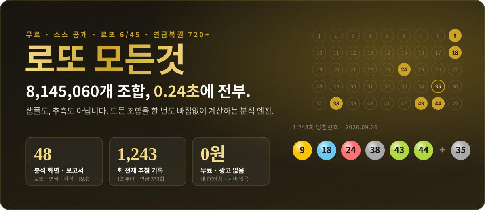
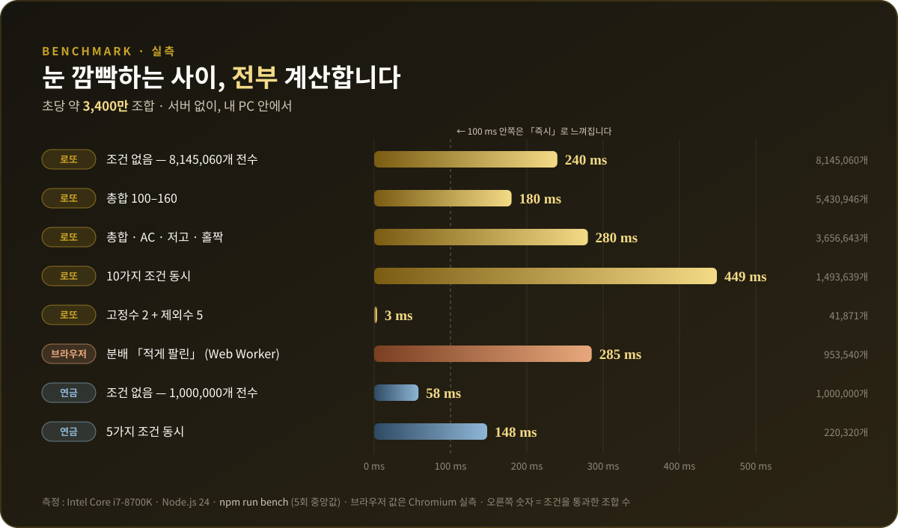
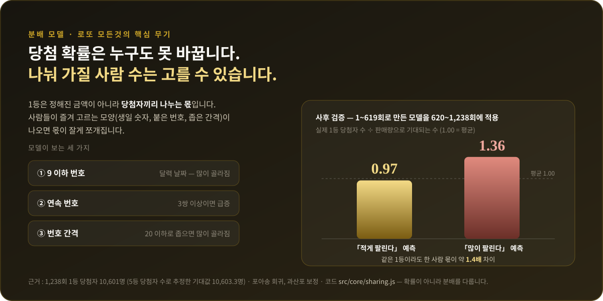
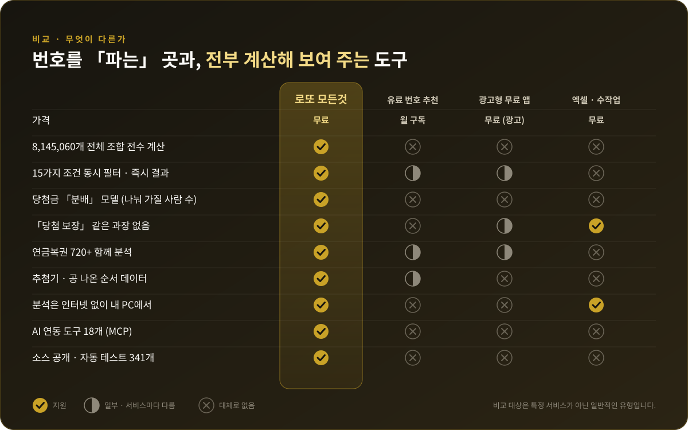
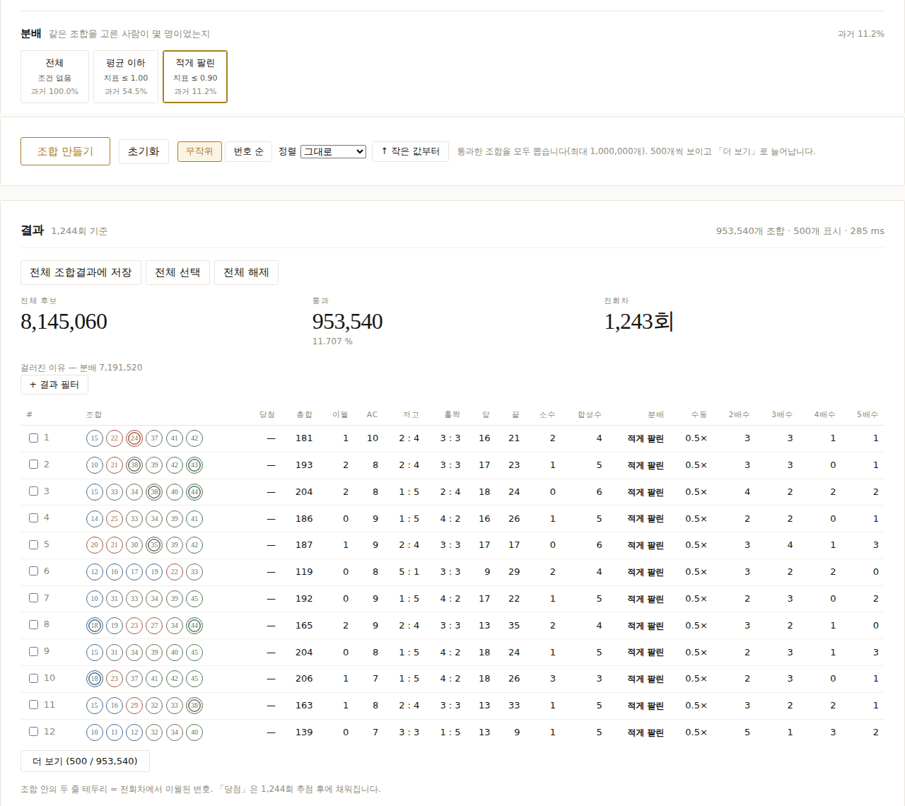
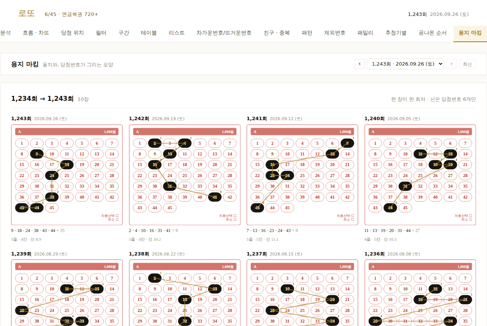
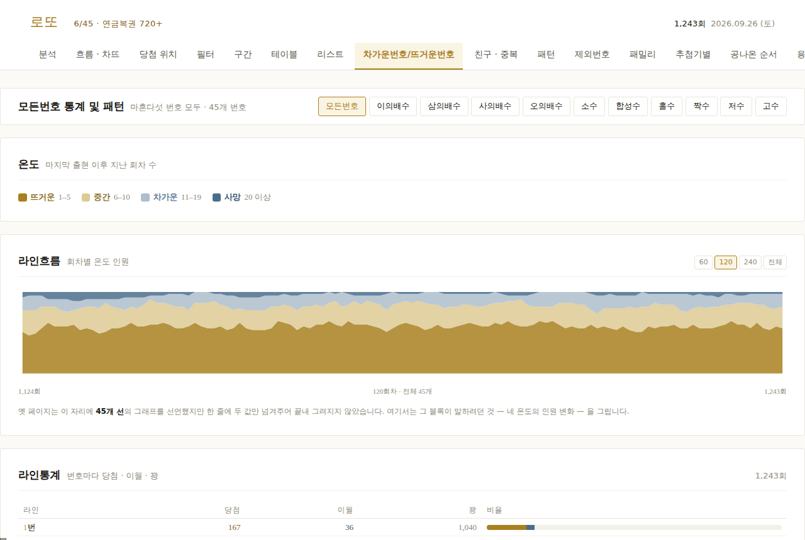
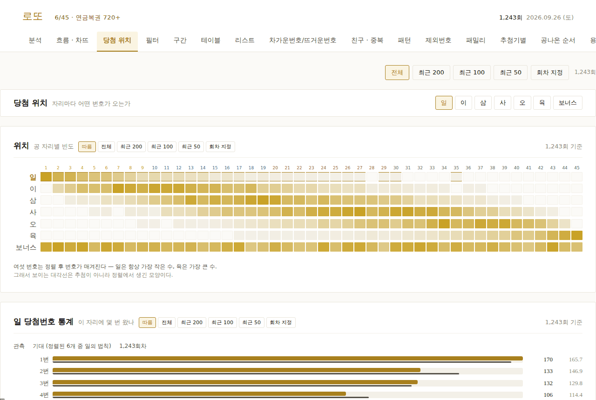
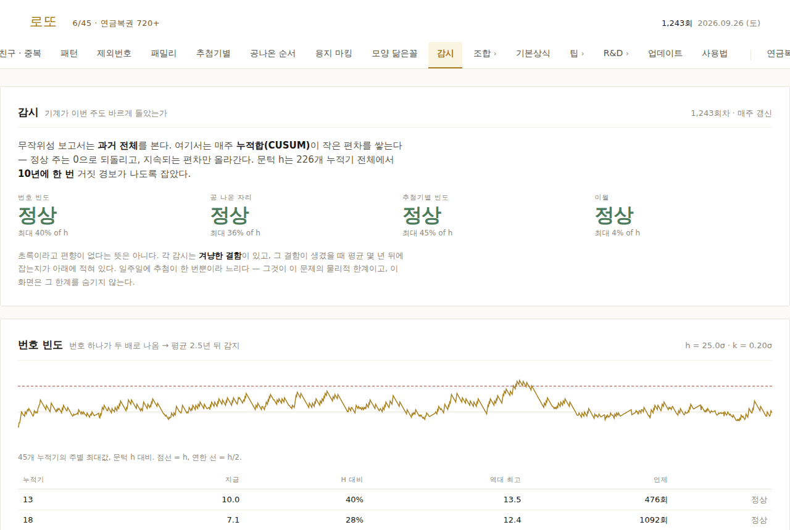
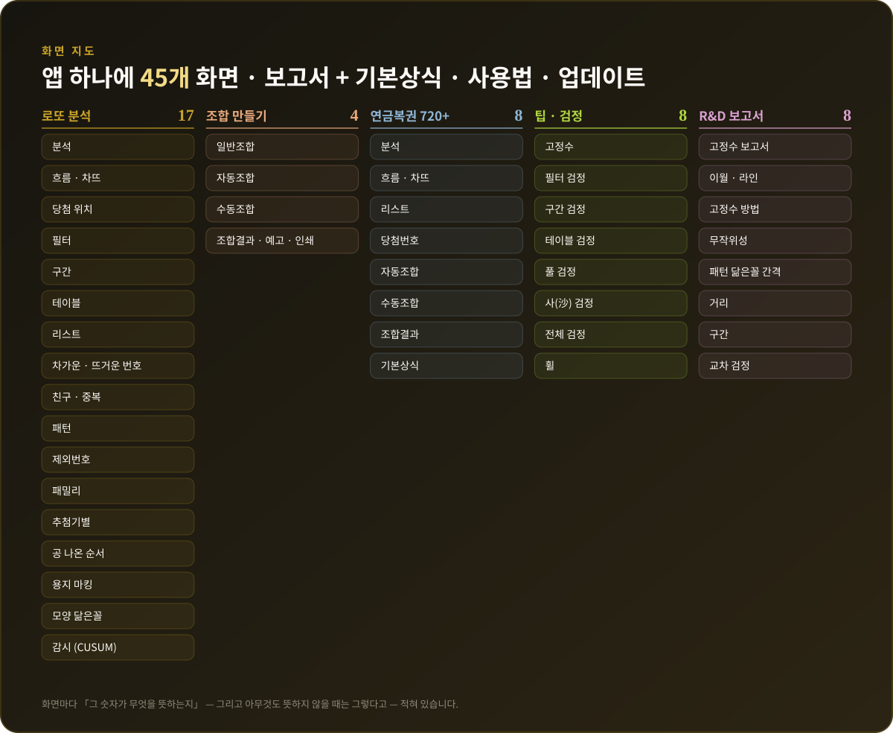

<p align="center">
  
</p>

<p align="center">
  
  
  
  
  
</p>

<h3 align="center">번호를 <em>파는</em> 사이트는 많습니다.<br>8,145,060개를 <strong>전부 계산해서, 그 근거까지 보여 주는</strong> 무료 도구 — <b>로또 모든것</b>.</h3>

<p align="center">
  로또 6/45 · 연금복권 720+ · 1회부터 최신 회차까지 · 설치 한 번 · 광고 0 · 구독 0 · 서버 0
</p>

<p align="center">
  <a href="https://github.com/yotoyo1090/lotto-modeungeot/releases/latest/download/lotto-modeungeot.zip"></a>
  <br><sub>받은 ZIP의 압축을 풀고 <b>설치하기.bat</b> 을 두 번 누르면 끝 · <a href="#-원클릭-설치-windows">자세히</a></sub>
</p>

---

## ⚡ 왜 로또 모든것인가

| 기능 | 무엇이 다른가 |
|---|---|
| 🚀 **0.24초 전수 탐색** | 로또의 모든 조합 **8,145,060개**를 한 번도 빠짐없이 훑습니다. 샘플링도, 「추천 알고리즘」이라는 블랙박스도 없습니다. 조건 10개를 한꺼번에 걸어도 **0.45초**. |
| 💰 **당첨금 「분배」 모델** | 확률은 누구도 못 바꿉니다. 하지만 **1등을 몇 명과 나눌지**는 조합의 모양에 따라 달라집니다. 실제 1,238회 당첨자 데이터로 만든 모델로, 남들이 덜 고르는 조합을 골라냅니다. |
| 🎯 **27가지 조건 · 결과 필터** | 총합 · AC값 · 저고 · 홀짝 · 소수 · 합성수 · 배수 · 구간 · 앞/끝자리 합 · 앞쌍 · 끝쌍 · 앞/끝자리 숫자 · 이월 개수 · 이월합 · 이월 위치 · 소수합 · 합성수합 · 2~5배수합 · 분배 · 수동 인기 · 당첨 개수 · 고정수 · 제외수. 걸자마자 **전체 조합**에 다시 적용됩니다. |
| 🎟️ **연금복권 720+까지** | 1,000,000개 번호 × 5개 조 = **5,000,000장** 전부를 0.06초에. 자리별 숫자, 반복 숫자, 전회차 대비까지. |
| 🔬 **51개 화면 · 보고서** | 흐름·차뜨, 당첨 위치, 친구·중복, 패턴, 추첨기별, **공 나온 순서**, 용지 마킹, 모양 닮은꼴, CUSUM 감시 … 그리고 모든 규칙을 과거 데이터로 **직접 검정**하는 화면들. |
| 🤖 **AI와 바로 연결** | MCP 서버 내장 — AI 비서에게 「1243회 분석해 줘」라고 말하면 도구 18개로 직접 계산해서 답합니다. |
| 🔒 **내 PC에서, 내 데이터로** | 분석은 인터넷 없이 브라우저 안에서 돌아갑니다. 계정도, 로그인도, 수집되는 개인정보도 없습니다. |

---

## 🏎️ 속도 — 실측입니다

<p align="center"></p>

> 숫자를 믿지 마세요. **직접 재 보세요.** `npm run bench` 한 줄이면 여러분의 PC에서 같은 표가 나옵니다.

비결은 단순합니다. 조건을 **조합을 만드는 도중에** 검사해서, 가망 없는 가지는 끝까지 가기 전에 잘라 냅니다. 무거운 계산(AC값)은 가벼운 조건을 통과한 조합에만 합니다. 그리고 모든 계산은 **Web Worker** 안에서 — 계산하는 동안에도 화면이 멈추지 않습니다.

---

## 💰 분배 — 다른 도구에는 없는 것

<p align="center"></p>

로또 1등은 **정해진 금액이 아니라 나눠 갖는 몫**입니다. 같은 날 같은 번호로 1등이 된 두 사람도, 그 번호를 **몇 명이 함께 골랐느냐**에 따라 받는 돈이 달라집니다.

- 생일(1~31, 특히 **9 이하**)로 고른 번호, **붙은 번호**가 많은 조합, **간격이 좁은** 조합은 많은 사람이 고릅니다.
- 로또 모든것은 과거 **1,238회의 실제 1등 당첨자 수**를 판매량(5등 당첨자 수로 추정)과 비교해, 조합의 모양마다 「몇 배나 많이 골라지는가」를 계산했습니다.
- 모델을 **절반의 데이터로 만들고 나머지 절반에서 검증**했습니다 — 「적게 팔린다」고 예측한 쪽은 실제 **0.97**, 「많이 팔린다」고 예측한 쪽은 실제 **1.36**.

자동조합에서 버튼 하나(「적게 팔린」)로 **8,145,060개 중 953,540개**만 남깁니다.

---

## ⚔️ 비교

<p align="center"></p>

---

## 🖼️ 화면

<p align="center">
  
  <br><sub><b>자동조합</b> — 「적게 팔린」 한 번에 8,145,060 → 953,540개, 285 ms. 체크해서 저장, 결과 필터, 정렬, 500개씩 「더 보기」.</sub>
</p>

<table>
  <tr>
    <td width="50%"><br><sub><b>용지 마킹</b> — 당첨번호가 용지 위에 그리는 모양, 회차별로.</sub></td>
    <td width="50%"><br><sub><b>차가운 · 뜨거운 번호</b> — 45개 번호의 온도가 1,243회 동안 흐르는 모습.</sub></td>
  </tr>
  <tr>
    <td width="50%"><br><sub><b>당첨 위치</b> — 자리(일~육 · 보너스)마다 어떤 번호가 오는가.</sub></td>
    <td width="50%"><br><sub><b>감시</b> — CUSUM 누적기 226개로 추첨기가 매주 제대로 뽑는지 지켜봅니다.</sub></td>
  </tr>
</table>

<p align="center"></p>

---

## 🧭 우리의 약속 — 과장하지 않습니다

> **로또 모든것은 당첨을 예측하지 않습니다.** 어떤 조건도, 어떤 필터도 1등 확률(1/8,145,060)을 바꾸지 못합니다.

「당첨 보장」, 「적중률 ○○%」 — 그런 문구는 이 저장소에 없습니다. 대신 화면마다 **그 숫자가 무엇을 뜻하는지**, 그리고 **아무것도 뜻하지 않을 때는 그렇다고** 적어 두었습니다. 「팁」과 「R&D」 메뉴는 흔히 도는 규칙(고정수, 제외수, 구간, 휠…)을 **과거 전체 데이터로 직접 검정**해서, 무엇이 우연과 구별되지 않는지 보여 줍니다.

그래서 믿을 수 있습니다. 그리고 그래서, 우리가 말하는 단 하나의 실제 이점 — **분배** — 에 무게가 실립니다.

---

## 🚀 원클릭 설치 (Windows)

**필요한 것 : 없음.** 인터넷 연결만 있으면 됩니다. 프로그램을 따로 설치할 필요가 없습니다 — 필요한 것은 설치 파일이 **전부 알아서** 설치합니다.

1. 위의 **[무료 다운로드]** 버튼으로 `lotto-modeungeot.zip` 을 받아 **압축을 풉니다** (ZIP 파일 우클릭 → 압축 풀기).
2. 풀린 폴더에서 **`설치하기.bat`** 을 **더블클릭**합니다. 그게 끝입니다.
   - **Node.js** 가 없거나 오래되었으면 자동으로 설치합니다 (처음 한 번, 1~3분 · 관리자 권한 창에서 **[예]**).
   - 화면 패키지 설치 → 추첨 데이터 생성 → 바탕화면에 **로또 분석** / **로또 분석 종료** 아이콘.
   - 설치가 끝나면 **앱이 바로 열립니다.**
3. 다음부터는 바탕화면의 **로또 분석** 아이콘만 누르면 됩니다.

> 💡 처음 한 번 Windows 보안 경고가 뜨면 **실행** (또는 **추가 정보 → 실행**)을 누르세요. 인터넷에서 받은 모든 설치 파일에 붙는 기본 경고이고, 설치 파일이 이 표시를 지워 두므로 다음부터는 뜨지 않습니다.

새 회차는 앱의 **업데이트** 탭에서 버튼 하나로 가져옵니다. 모든 화면의 읽는 법은 **사용법** 탭에 있습니다.

<details>
<summary><b>개발자용 — 명령어</b></summary>

```bash
git clone https://github.com/yotoyo1090/lotto-modeungeot.git
cd lotto-modeungeot
npm --prefix web install   # 루트 프로젝트는 의존성 0개 (node:sqlite, node:http)
npm run build:data         # 화면용 데이터 생성
npm run web                # http://localhost:5173
```

| 명령 | 내용 |
|---|---|
| `npm test` | 테스트 (355개) |
| `npm run bench` | 속도 측정 — 위 그래프를 여러분 PC에서 |
| `npm run update` | 추첨 · 추첨기 · 공 나온 순서 수집 후 데이터 생성 |
| `npm run build:data` | 화면용 데이터 생성 |
| `npm run web` | 개발 서버 |
| `npm run mcp` | MCP 서버 (AI 연결) |

</details>

<details>
<summary><b>AI와 연결하기 — MCP</b></summary>

MCP 클라이언트 설정에 추가하면, AI가 로또 모든것의 계산 엔진을 직접 사용합니다.

```json
{
  "mcpServers": {
    "lotto": {
      "command": "node",
      "args": ["--experimental-sqlite", "C:\\경로\\lotto-modeungeot\\tools\\mcp.js"]
    }
  }
}
```

도구 18개 : `status` · `draw` · `analysis` · `generate` · `sql` · `board` · `list` · `section` · `filter` · `hotcold` · `hl` · `table` · `pattern` · `excluded` · `pension` · `machine` · `order` · `watch`

</details>

<details>
<summary><b>구성</b></summary>

| 폴더 | 내용 |
|---|---|
| `src/core` | 계산 엔진 (브라우저와 Node 공용, 의존성 없음) |
| `src/node` | 수집 · 데이터베이스 (node:sqlite) |
| `src/mcp` | AI 연결 (MCP) |
| `web` | 화면 (Svelte 5 + Vite, Web Worker) |
| `tools` | 수집 · 데이터 생성 · 벤치마크 · 관리 |
| `app` | 바탕화면 설치 · 실행 |
| `data/lotto.sqlite` | 공개 추첨 기록 |
| `test` | 테스트 |

</details>

---

## 📚 데이터 출처

- 당첨번호 · 당첨금 · 당첨자 수 : [동행복권](https://www.dhlottery.co.kr) 공개 결과
- 추첨기 · 공 나온 순서 : [lottotapa.com](https://lottotapa.com) 공개 통계

---

<p align="center">
  <sub>복권은 즐거움으로, 여유 자금 안에서. 도박 문제로 어려움이 있다면 한국도박문제예방치유원 <b>☎ 1336</b> (24시간 무료 상담).</sub>
</p>
